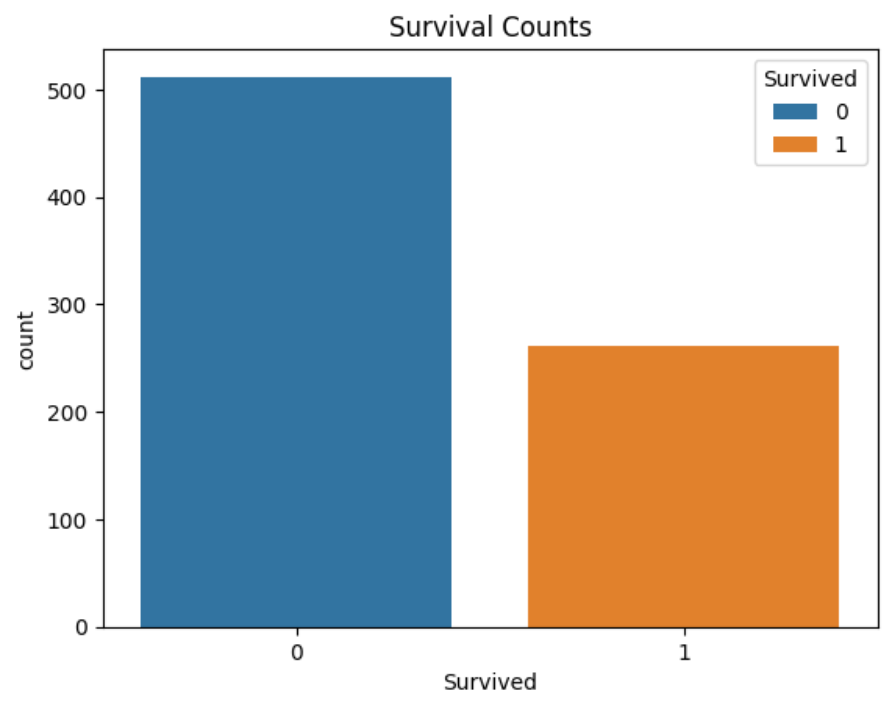
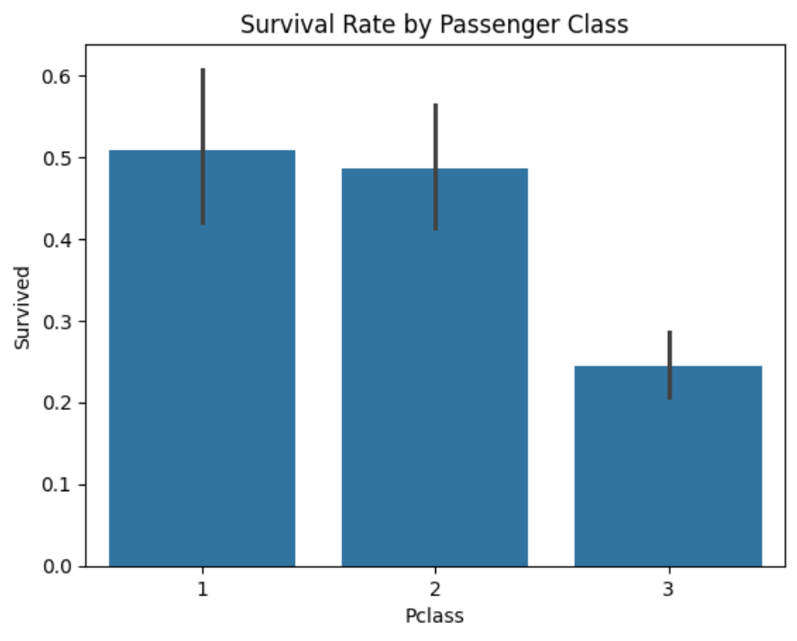
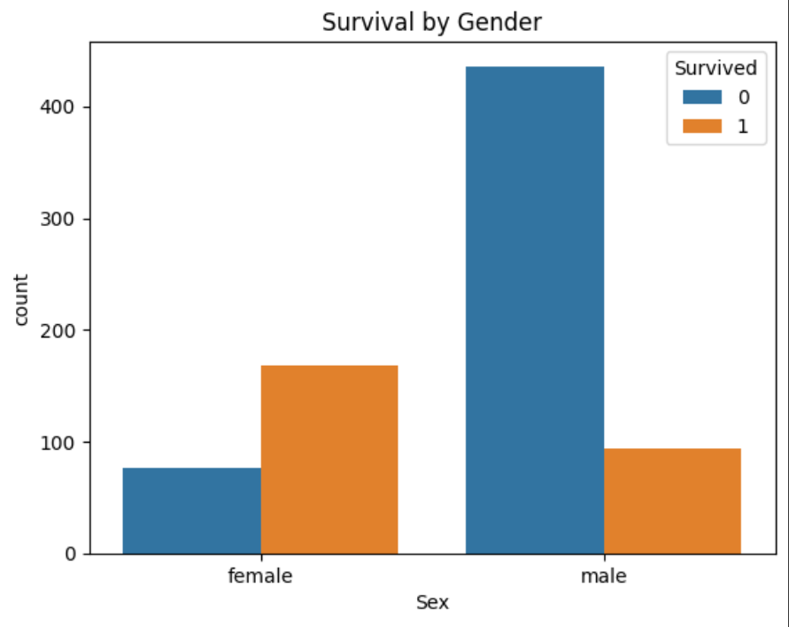
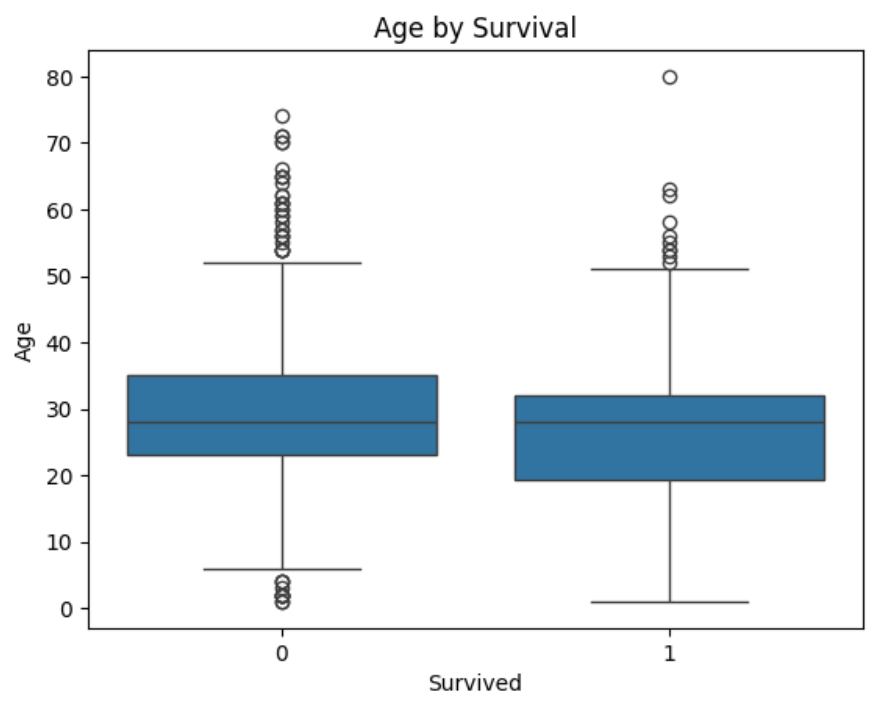
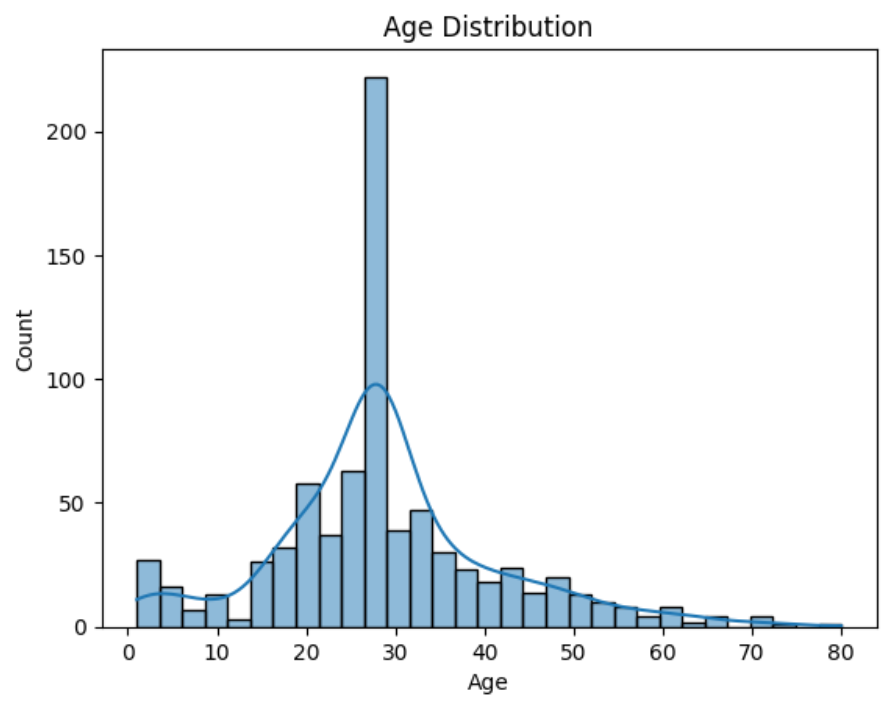
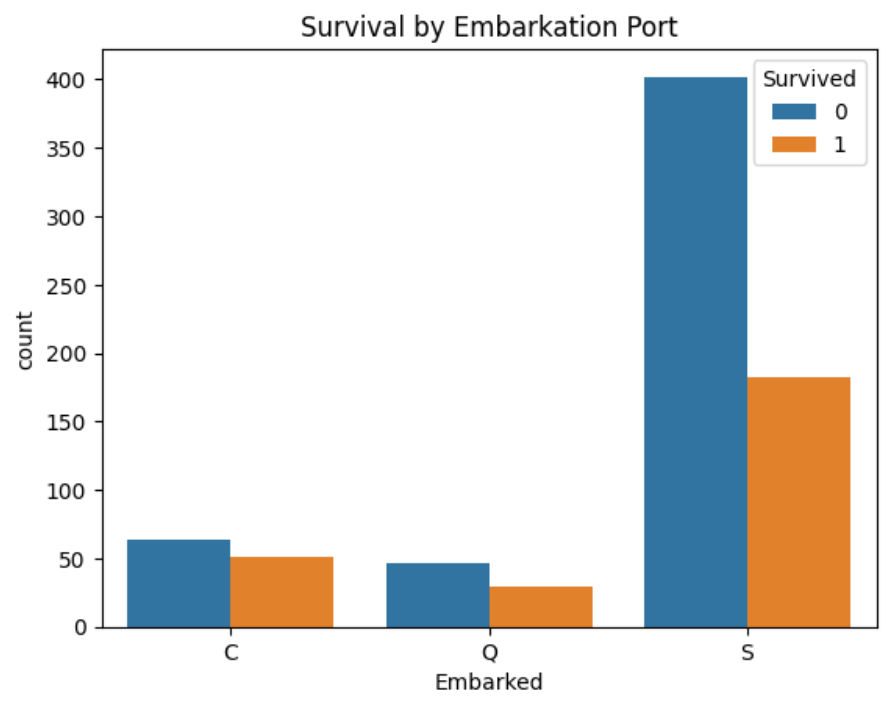
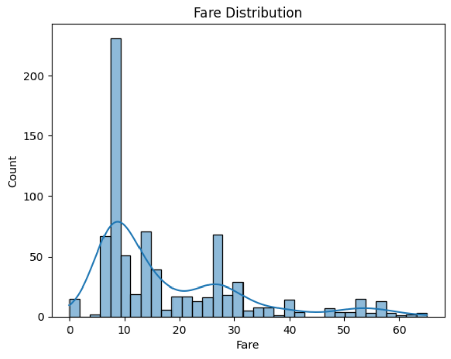
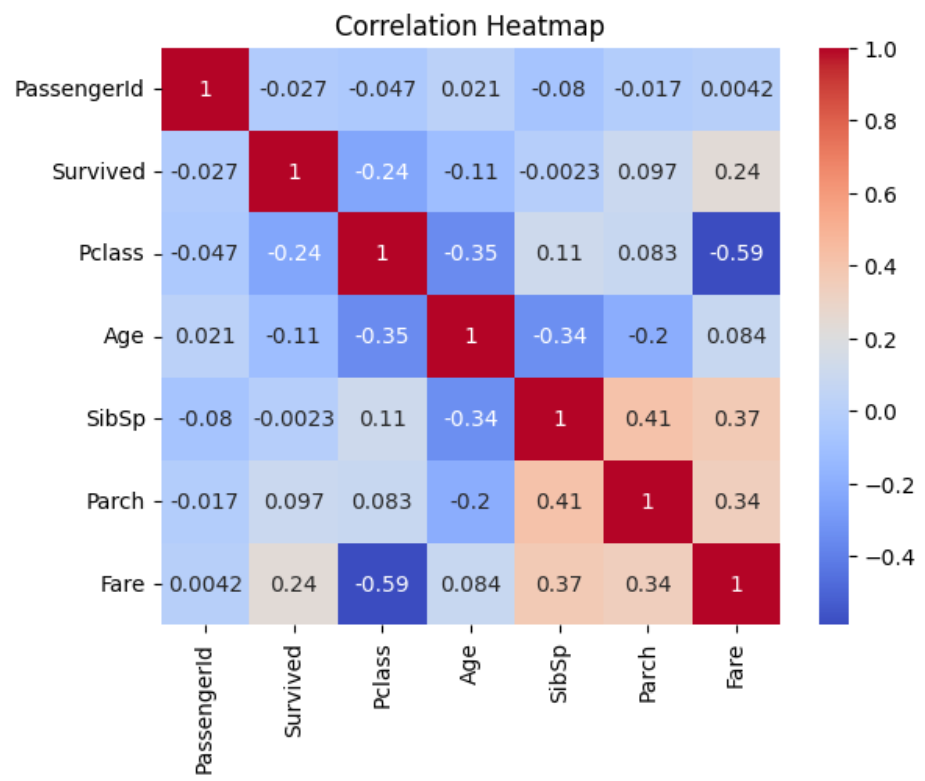
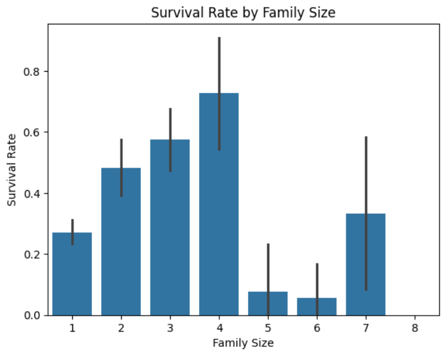
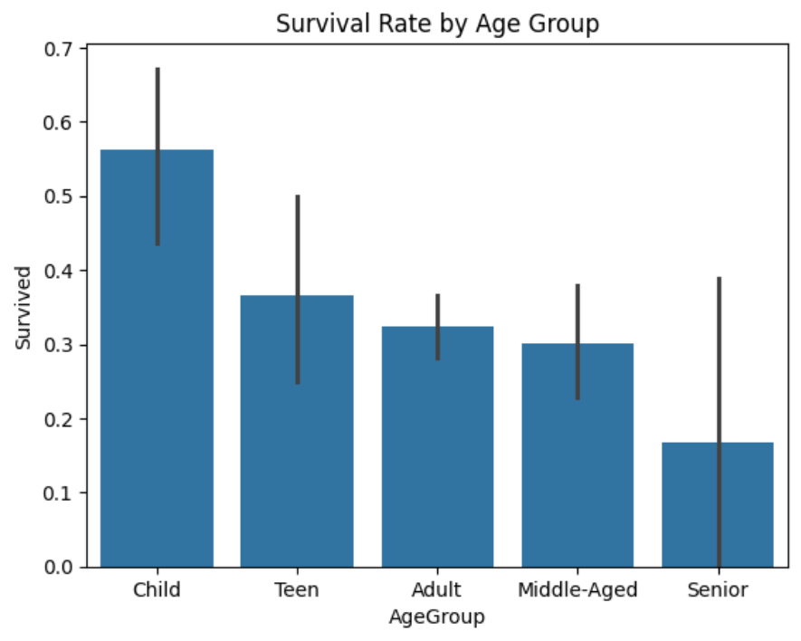

# 🚢 Titanic Survival Analysis

## 📌 Project Overview
This project analyzes the famous **Titanic dataset** (from Kaggle) to explore the factors that affected passenger survival.  
The analysis covers data cleaning, exploratory data analysis (EDA), statistical testing, feature engineering, and visualization to extract meaningful insights.  
A simple predictive model (Logistic Regression) is also implemented to demonstrate survival prediction.  

---

## 🎯 Objectives
- Explore the Titanic dataset and understand passenger demographics.  
- Clean and preprocess the data (handle missing values, drop irrelevant columns).  
- Perform **exploratory data analysis (EDA)** to uncover survival patterns.  
- Conduct **statistical tests** to validate relationships (e.g., Gender ↔ Survival).  
- Create new **engineered features** (family size, age groups, travel status).  
- Summarize **key findings** with clear, business-friendly insights.  
- Build a **basic predictive model** to estimate survival outcomes.  

---

## 📂 Project Structure
├── Titanic_Analysis.ipynb # Jupyter Notebook with full analysis                                                                                                                                
├── Titanic.csv # Dataset                                                                                                                                                                       
├── README.md # Project documentation 

---

## 🛠️ Tools & Libraries
- **Python** (Pandas, NumPy)  
- **Visualization:** Matplotlib, Seaborn    
- **Environment:** Jupyter Notebook  

---

## 📊 Key Analysis & Insights
- **Gender:** Females had a survival rate of ~74%, compared to ~19% for males.  
- **Passenger Class:** 1st class passengers had much higher survival rates compared to 3rd class.  
- **Age:** Children had better survival chances than adults.  
- **Family Size:** Passengers traveling with family were more likely to survive than those alone.

---

## 🧩 Feature Engineering
New features were created to strengthen the analysis:  
- `FamilySize = SibSp + Parch + 1`  
- `IsAlone = 1 if FamilySize == 1 else 0`  
- `AgeGroup` (Child, Teen, Adult, Middle-aged, Senior)  

---

## ✅ Conclusions
- **Women and children first**: Gender and age were crucial in survival chances.  
- **Wealth mattered**: 1st class passengers had priority access to lifeboats.  
- **Traveling with family helped**: Family presence increased survival rates.  
- These findings align with historical accounts of the Titanic disaster.  

---

## 📊 Dashboard
<table>
  <tr>
    <td></td>
    <td></td>
  </tr>
  <tr>
    <td></td>
    <td></td>
  </tr>
</table>

<table>
  <tr>
    <td></td>
    <td></td>
  </tr>
  <tr>
    <td></td>
    <td></td>
  </tr>
</table>

<table>
  <tr>
    <td></td>
    <td></td>
  </tr>
</table>

---

## 🚀 Next Steps  
- Deploy an **interactive dashboard** (Streamlit / Tableau / Power BI).  
- Expand storytelling with more advanced visualizations.  

---

## 📎 References
- [Kaggle Titanic Dataset](https://www.kaggle.com/c/titanic)  
- Historical context: *A Night to Remember* (Walter Lord, 1955)  

